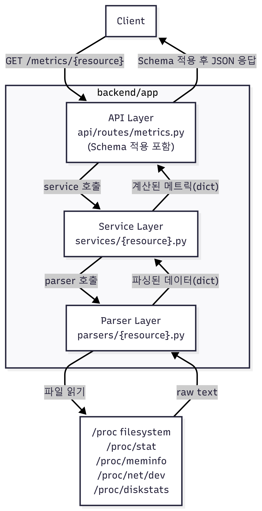

# Architecture Design

## 1. Project Overview
### 1.1 Project Name
- Linux Web Dashboard

### 1.2 Goal
> 프로젝트의 본질, 왜 이 프로젝트를 구현하는 지, 무엇을 이루고 싶은 지

- Linux 시스템이 metric(측정 지표) 정보를 어떻게 제공하는지 이해하기 위해 `/proc` filesystem 기반 모니터링 프로젝트를 구현한다.
- 라이브러리 사용을 최소화하고 직접 파싱과 API를 설계하여 개발 역량과 키운다.
- Linux 기반 인프라/백엔드 개발 시 필요한 기술을 이해하기 위한 프로젝트를 만든다.

### 1.3 Objectives
> 어떤 기능을 구현할 것인지, 어떤 기술을 사용할 것인지, 어떤 결과물을 낼 것인지

- Linux `/proc` filesystem을 이해하고 CPU, memory, network, disk 관련 데이터를 파싱한다.
- FastAPI 기반으로 metric 조회 API를 설계/구현한다.
- 로컬 개발 환경과 Docker 실행 환경을 구성한다.
- systemd 서비스 실행 방식을 학습한다.
- 개발 일지, decision log, troubleshooting 문서를 통해 학습 과정과 구현 근거를 남긴다.

## 2. System Scope
### 2.1 In Scope
> 해당 프로젝트의 최소 완성 기준

- `/proc/stat`, `/proc/meminfo`, `/proc/net/dev`, `/proc/diskstats`를 파싱하여 주요 시스템 metric을 수집한다.
- `GET /health`, `GET /metrics/cpu`, `GET /metrics/memory`, `GET /metrics/network`, `GET /metrics/disk` endpoint를 구현한다.
- Ubuntu Linux 환경에서 동작하는 FastAPI 백엔드를 개발하고 검증한다.
- Docker 기반 실행 환경을 구성한다.
- 프로젝트 진행 과정에서 [architecture](architecture.md), [API spec](api-spec.md), [dev log](dev-log.md), [decision log](decision-log.md), [troubleshooting](troubleshooting.md) 문서를 유지한다.
### 2.2 Out of Scope
> 해당 프로젝트에서 하지 않을 것

- metric 데이터를 DB에 저장하거나 시계열 데이터로 관리하지 않는다.
- 멀티 호스트 환경이나 중앙 집중식 모니터링 서버는 구현하지 않는다.
- 로그인, 권한 관리, 사용자별 기능 분리는 다루지 않는다.
- 화려한 웹 UI나 복잡한 프론트엔드 기능은 프로젝트에 반영하지 않는다.
- production-grade alerting, external integrations, large-scale deployment는 이번 범위에서 제외한다.
  - production-grade alerting: 실제 운영 서비스에서 쓰는 알림 시스템
    - 중복 알림 방지, 알림 이력 관리 등
  - external integrations: 외부 시스템과 연결하는 기능.
    - Discord, Email, Prometheus, Grafana, Telegram 등
  - Large-scale deployment: 큰 규모 환경에 배포하는 것
    - 여러 서버 동시 설치, Kubernetes 배포, 로드밸런서 뒤에 배치, 고가용성, 자동 확장 등

## 3. High-Level Architecture
### 3.1 Components
> 해당 프로젝트를 완성하기 위한 독립적인 components

해당 프로젝트에서는 네 가지의 일을 한다.
1. Linux 파일 읽기
2. 필요한 수치 파싱
3. usage 계산
4. API 응답

하나의 component에 해당 기능을 다 넣으면, 코드가 길어지고, 유지보수가 어렵고, 테스트가 복잡하기 때문에 여러 개의 component 단위로 분리한다.

- Parser Layer: 리눅스 파일 해석
  - `/proc` 포맷 처리 로직을 한 곳에서 관리
  - 다른 계층이 파일 형식을 몰라도 기능할 수 있게 하기 위해서
  - API 코드와 Linux 파싱 코드 분리
  - Parser가 계산까지 다 하면? parsing logic과 business logic이 섞여서 재사용 어려움

- Service Layer: 데이터를 유의미한 정보로 만들기
  - business logic을 한 곳에서 관리
  - 계산 로직을 분리
  
- API Layer: 웹의 소통 창구
  - 웹 request/response 처리 책임 분리
  - FastAPI 의존성을 다른 로직에게 주지 않기 위해서
  - route 함수를 단순하게 유지하기 위해서

- Schema Layer: 데이터 구조 정의
  - response 구조를 일관되게 유지하기 위해서
  - 문서화와 테스트 쉽게하려고
  - Schema 없이 dict만 반환하면? 필드명이 관리 어렵고, response 형식 뒤섞임

- Optional Alert Layer: 추가 알람 기능
  - 경고 기능 확장 생각 중

### 3.2 Data Flow
> 요청이 들어오면 내부에서 어떤 순서로 데이터가 처리되는지 

  

- Client가 /metrics/memory request
- route handler가 service 호출
- service가 parser 호출
- parser가 /proc/meminfo 수집
- service가 usage 계산
- schema에 맞게 JSON 변환

## 4. Directory Structure
> 각 디렉터리의 존재 이유와 책임

| Directory      | Responsibility |
|----------------|----------------|
| `api/routes/`  | FastAPI endpoint 정의 및 HTTP 요청/응답 처리 |
| `services/`    | 메트릭 계산, parser 호출, business logic 처리 |
| `parsers/`     | `/proc` 파일 읽기 및 raw text parsing |
| `schemas/`     | request/response model 정의 및 validation |
| `core/`        | 공통 예외, 설정, 유틸리티 관리 |

## 5. Layer Responsibilities
> 각 Layer가 하는 일

### 5.1 Parser Layer
- `/proc` 파일을 읽고 필요한 raw text 데이터를 추출한다.
- 추출한 값을 Python에서 다루기 쉬운 structured data 형태로 변환한다.

예:
- `/proc/meminfo`에서 MemTotal, MemAvailable 읽기
- `/proc/net/dev`에서 인터페이스별 rx/tx 값 읽기

### 5.2 Service Layer
- parser layer가 반환한 raw data를 바탕으로 usage, rate, summary 같은 메트릭을 계산한다.
- 여러 parser 결과를 조합하여 API에서 바로 사용할 수 있는 형태의 데이터를 만든다.
- business logic과 metric calculation 책임을 담당한다.

### 5.3 API Layer
- FastAPI endpoint를 정의하고 HTTP 요청과 응답을 처리한다.
- 필요한 service를 호출하여 메트릭 데이터를 가져오고 JSON 형태로 반환한다.
- HTTP 수준의 예외 처리와 상태 코드를 관리한다.

### 5.4 Schema Layer
- request와 response에 사용되는 데이터 모델을 정의한다.
- API 응답 형식을 일관되게 유지하고 validation을 돕는다.

## 6. Metric Collection Design
> `/proc`에서 뭘 읽고, 그걸 어떻게 해석해서 metric으로 만들었는가

### 6.1 CPU Metrics
- Source: `/proc/stat`
- 첫 번째 `cpu` 라인은 부팅 이후 누적된 CPU time counter를 제공한다.
- 이 값들은 현재 CPU usage percentage가 아니라 cumulative counter이므로, single read만으로는 사용률을 계산할 수 없다.
- 따라서 짧은 시간 간격으로 두 번 읽고, total time과 idle time의 delta를 이용해 usage를 계산한다.

Calculation idea:
- `total = user + nice + system + idle + iowait + irq + softirq + steal`
- `idle_all = idle + iowait`
- `total_delta = total_t2 - total_t1`
- `idle_delta = idle_t2 - idle_t1`
- `usage_percent = (total_delta - idle_delta) / total_delta * 100`

Why:
- `/proc/stat`는 instantaneous percentage(순간 퍼센트값)가 아니라 cumulative counter(누적 카운터)를 저장한다.
- 따라서 CPU usage는 두 시점의 차이를 이용해 계산해야 한다.

### 6.2 Memory Metrics
- Source: `/proc/meminfo`
- 주요 필드로 `MemTotal`과 `MemAvailable`을 사용한다.
- `MemTotal`은 전체 물리 메모리 크기를 의미한다.
- `MemAvailable`은 새 프로그램이 사용할 수 있다고 추정되는 메모리 양을 의미한다.
- 초기 버전에서는 아래와 같이 memory usage를 계산한다.

Calculation idea:
- `used_kb = total_kb - available_kb`
- `usage_percent = used_kb / total_kb * 100`

Why:
- `MemFree`는 완전히 비어 있는 메모리만 의미하므로 실제 사용 가능 메모리를 충분히 설명하지 못한다.
- Linux는 buffer/cache를 위해 메모리를 사용하지만, 이 메모리는 필요 시 일부 회수할 수 있다.
- 따라서 memory usage 계산에는 `MemFree`보다 `MemAvailable`을 사용하는 것이 더 적절하다.

Notes:
- `shared`, `buffers`, `cached` 값은 초기 버전에서는 상세 메트릭으로 사용하지 않는다.
- 필요하다면 추후 상세 memory endpoint에서 추가로 노출할 수 있다.

### 6.3 Network Metrics
- Source: `/proc/net/dev`
- 네트워크 인터페이스별 `rx_bytes`, `tx_bytes`, `rx_packets`, `tx_packets` 값을 수집한다.
- `rx`는 받은 데이터, `tx`는 보낸 데이터를 의미한다.
- `bytes`는 데이터 양, `packets`는 전송된 패킷 수를 의미한다.

Design idea:
- 인터페이스별 네트워크 통계를 리스트 형태로 반환한다.
- 초기 버전에서는 복잡한 계산 없이 raw counter를 그대로 제공한다.

Why:
- `/proc/net/dev`는 인터페이스 단위 네트워크 통계를 직접 제공한다.
- 초기 버전에서는 네트워크 사용량을 단순하고 명확하게 보여주는 것이 목표이다.
- rate 계산이나 filtering은 이후 확장 기능으로 분리하는 것이 구조상 더 단순하다.

Notes:
- `lo`는 loopback interface로, 시스템 내부 통신에 사용된다.
- loopback 포함 여부는 추후 결정한다.

### 6.4 Disk Metrics
- Source: `/proc/diskstats`
- 디스크별 읽기/쓰기 관련 counter를 수집한다.
- 초기 버전에서는 `reads_completed`, `writes_completed`, `sectors_read`, `sectors_written`를 사용한다.

Design idea:
- 전체 디스크 장치 기준으로 메트릭을 노출한다.
- partition 단위 메트릭은 초기 버전에서 제외한다.
- 복잡한 계산 없이 raw counter를 그대로 제공한다.

Why:
- `/proc/diskstats`는 Linux의 디스크 I/O 통계를 직접 제공한다.
- 초기 버전에서는 단순하고 이해하기 쉬운 메트릭 제공이 우선이다.
- 전체 디스크 기준으로 시작하면 응답 구조를 더 간단하게 유지할 수 있다.

Notes:
- `sda`, `nvme0n1`은 전체 디스크 장치이다.
- `sda1`, `nvme0n1p1`은 해당 디스크의 partition이다.

## 7. Error Handling Strategy
- `/proc` 파일을 읽을 수 없는 경우 적절한 예외를 발생시키고, API에서는 명확한 오류 메시지와 함께 실패 응답을 반환한다.
- Linux 환경이 아닌 경우 이 프로젝트가 지원하지 않는 실행 환경임을 명시적으로 처리한다.
- `/proc` 파일 형식이 예상과 다르거나 parsing에 실패한 경우, 조용히 무시하지 않고 오류로 기록한다.
- API layer에서는 내부 예외를 적절한 HTTP status code와 error response로 변환한다.
- 초기 버전에서는 복잡한 복구 로직보다는, 실패 원인을 확인할 수 있는 명확한 오류 처리에 집중한다.

Why:
- 이 프로젝트는 Linux `/proc` 파일에 직접 의존하므로 파일 접근 실패나 parsing 실패 가능성을 고려해야 한다.
- 오류를 숨기면 디버깅과 문제 분석이 어려워진다.
- 초기 버전에서는 안정적인 fallback보다 명확한 실패와 원인 파악이 더 중요하다.

## 8. Deployment Architecture

### 8.1 Local Development
- Windows 호스트 환경에서 Ubuntu 24.04 VM을 사용하여 개발하고 테스트한다.
- 개발 도구로 VSCode와 Python 환경을 사용한다.
- FastAPI 애플리케이션은 로컬 Linux 환경에서 실행하며 `/proc` 기반 기능을 검증한다.

### 8.2 systemd Service
- 추후 백엔드를 Linux systemd 서비스로 등록하여 백그라운드에서 실행할 수 있도록 한다.
- 필요 시 부팅 시 자동 시작(auto-start)도 가능하도록 구성할 수 있다.
- 초기 단계에서는 개념 학습과 기본 등록 방식 이해를 목표로 한다.

### 8.3 Docker Deployment
- 애플리케이션을 Docker 컨테이너로 패키징하여 실행 가능하도록 구성한다.
- Docker를 통해 실행 환경을 일정하게 유지하고 배포 과정을 단순화한다.
- Linux 기반 환경에서 동작하는 백엔드라는 점을 고려하여 컨테이너 실행 방식을 검토한다.

Why:
- Local development 환경은 실제 `/proc` 파일을 확인할 수 있는 Linux 환경이어야 하므로 Ubuntu VM이 필요하다.
- systemd는 Linux 서비스 실행 방식을 이해하는 데 도움이 되며, 이 프로젝트의 운영 형태와도 잘 맞는다.
- Docker는 실행 환경 차이를 줄이고 재현 가능한 실행 방법을 제공한다.

## 9. Design Principles
- `psutil` 같은 고수준 시스템 라이브러리 대신 Linux `/proc` filesystem을 직접 파싱한다.
- parsing, metric calculation, API handling, schema definition의 책임을 분리하여 각 계층이 명확한 역할을 갖도록 한다.
- 초기 버전에서는 복잡한 기능보다 작고 동작하는 구조를 우선한다.
- 구현 과정에서 발생한 학습 내용, 의사결정, 문제 해결 과정을 문서로 함께 기록한다.
- 프로젝트의 핵심 목표는 화려한 기능 추가보다 Linux 시스템 메트릭 수집 방식과 백엔드 구조를 이해하는 데 둔다.

## 10. Future Extensions